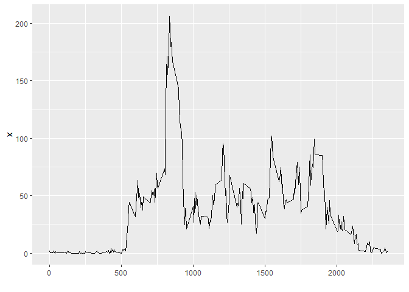
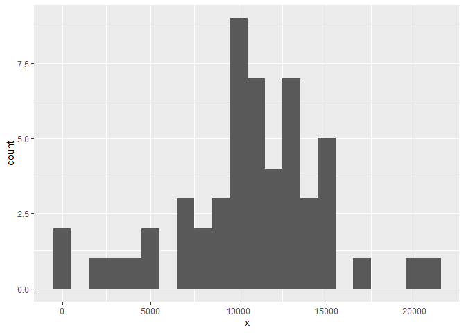
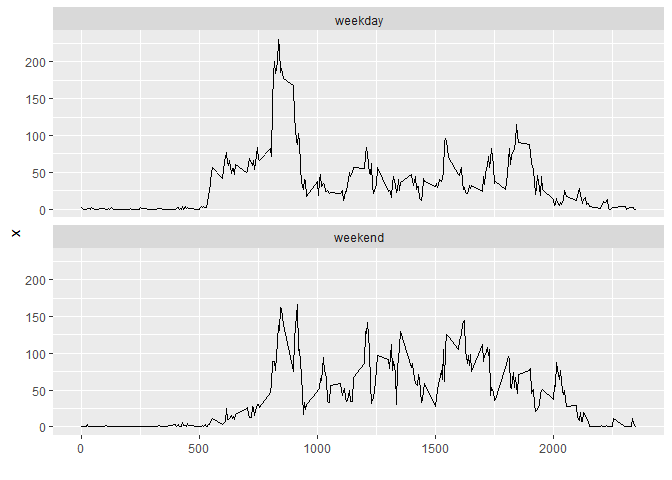

## Loading and preprocessing the data
Before loading the file, the provided zip-archive is unzipped and the containing file is stored in the same directory. Then, the file CSV file is loaded.


```r
data <- read.csv("activity.csv", header=T)
data <- cbind(data, date_correct = as.Date(data$date, format="%Y-%m-%d"))
data <- subset(data, select=c(steps,date_correct,interval))
colnames(data) <- c("steps","date","interval")
```

The date is not recognized as date. Therefore, we convert it to the type date using the mentioned functions.


## What is mean total number of steps taken per day?

We want to calculate the total number of steps per day. The data should be displayed as a histogram. We will use the library ggplot2 to create the relevant plot.


```r
library(ggplot2)

totals <- aggregate (x = data$steps, by=list(data$date), FUN = sum)

ggplot(totals, aes(x=x)) + geom_histogram(binwidth=1000)
```

```
## Warning: Removed 8 rows containing non-finite values (stat_bin).
```

<!-- -->

In addition, we want to show the mean and the median per day.

```r
means <- aggregate (x = data$steps, by=list(data$date), FUN = mean)
medians <- aggregate (x = data$steps, by=list(data$date), FUN = median)

means
```

```
##       Group.1          x
## 1  2012-10-01         NA
## 2  2012-10-02  0.4375000
## 3  2012-10-03 39.4166667
## 4  2012-10-04 42.0694444
## 5  2012-10-05 46.1597222
## 6  2012-10-06 53.5416667
## 7  2012-10-07 38.2465278
## 8  2012-10-08         NA
## 9  2012-10-09 44.4826389
## 10 2012-10-10 34.3750000
## 11 2012-10-11 35.7777778
## 12 2012-10-12 60.3541667
## 13 2012-10-13 43.1458333
## 14 2012-10-14 52.4236111
## 15 2012-10-15 35.2048611
## 16 2012-10-16 52.3750000
## 17 2012-10-17 46.7083333
## 18 2012-10-18 34.9166667
## 19 2012-10-19 41.0729167
## 20 2012-10-20 36.0937500
## 21 2012-10-21 30.6284722
## 22 2012-10-22 46.7361111
## 23 2012-10-23 30.9652778
## 24 2012-10-24 29.0104167
## 25 2012-10-25  8.6527778
## 26 2012-10-26 23.5347222
## 27 2012-10-27 35.1354167
## 28 2012-10-28 39.7847222
## 29 2012-10-29 17.4236111
## 30 2012-10-30 34.0937500
## 31 2012-10-31 53.5208333
## 32 2012-11-01         NA
## 33 2012-11-02 36.8055556
## 34 2012-11-03 36.7048611
## 35 2012-11-04         NA
## 36 2012-11-05 36.2465278
## 37 2012-11-06 28.9375000
## 38 2012-11-07 44.7326389
## 39 2012-11-08 11.1770833
## 40 2012-11-09         NA
## 41 2012-11-10         NA
## 42 2012-11-11 43.7777778
## 43 2012-11-12 37.3784722
## 44 2012-11-13 25.4722222
## 45 2012-11-14         NA
## 46 2012-11-15  0.1423611
## 47 2012-11-16 18.8923611
## 48 2012-11-17 49.7881944
## 49 2012-11-18 52.4652778
## 50 2012-11-19 30.6979167
## 51 2012-11-20 15.5277778
## 52 2012-11-21 44.3993056
## 53 2012-11-22 70.9270833
## 54 2012-11-23 73.5902778
## 55 2012-11-24 50.2708333
## 56 2012-11-25 41.0902778
## 57 2012-11-26 38.7569444
## 58 2012-11-27 47.3819444
## 59 2012-11-28 35.3576389
## 60 2012-11-29 24.4687500
## 61 2012-11-30         NA
```

```r
medians
```

```
##       Group.1  x
## 1  2012-10-01 NA
## 2  2012-10-02  0
## 3  2012-10-03  0
## 4  2012-10-04  0
## 5  2012-10-05  0
## 6  2012-10-06  0
## 7  2012-10-07  0
## 8  2012-10-08 NA
## 9  2012-10-09  0
## 10 2012-10-10  0
## 11 2012-10-11  0
## 12 2012-10-12  0
## 13 2012-10-13  0
## 14 2012-10-14  0
## 15 2012-10-15  0
## 16 2012-10-16  0
## 17 2012-10-17  0
## 18 2012-10-18  0
## 19 2012-10-19  0
## 20 2012-10-20  0
## 21 2012-10-21  0
## 22 2012-10-22  0
## 23 2012-10-23  0
## 24 2012-10-24  0
## 25 2012-10-25  0
## 26 2012-10-26  0
## 27 2012-10-27  0
## 28 2012-10-28  0
## 29 2012-10-29  0
## 30 2012-10-30  0
## 31 2012-10-31  0
## 32 2012-11-01 NA
## 33 2012-11-02  0
## 34 2012-11-03  0
## 35 2012-11-04 NA
## 36 2012-11-05  0
## 37 2012-11-06  0
## 38 2012-11-07  0
## 39 2012-11-08  0
## 40 2012-11-09 NA
## 41 2012-11-10 NA
## 42 2012-11-11  0
## 43 2012-11-12  0
## 44 2012-11-13  0
## 45 2012-11-14 NA
## 46 2012-11-15  0
## 47 2012-11-16  0
## 48 2012-11-17  0
## 49 2012-11-18  0
## 50 2012-11-19  0
## 51 2012-11-20  0
## 52 2012-11-21  0
## 53 2012-11-22  0
## 54 2012-11-23  0
## 55 2012-11-24  0
## 56 2012-11-25  0
## 57 2012-11-26  0
## 58 2012-11-27  0
## 59 2012-11-28  0
## 60 2012-11-29  0
## 61 2012-11-30 NA
```


## What is the average daily activity pattern?

To obtain the average daily activity pattern, we first calculate the menas by interval. As there are a lot of NA values, we remove them in order to get a valid result. Then, we plot the data.

```r
means_plot <- aggregate(x = data$steps, by=list(data$interval), FUN = mean, na.rm=TRUE, na.action=na.omit)
p <- ggplot(means_plot, aes(x=Group.1, y = x))+geom_line() + xlab("")
p
```

<!-- -->
Next, we determine the interval with the maximum average number of steps.

```r
max_steps = means_plot[means_plot$x == max(means_plot$x),]
colnames(max_steps) = c("Interval", "Mean no. of steps")
max_steps
```

```
##     Interval Mean no. of steps
## 104      835          206.1698
```
The relevant interval is 835.

## Imputing missing values

First, we get the number of missing values.

```r
sum(is.na(data$steps))
```

```
## [1] 2304
```

To make up for the missing values, we pursue the strategy of imputing the mean number of steps per interval. The new data set is denoted as `data_new`.

```r
require(Hmisc)
```

```
## Loading required package: Hmisc
```

```
## Warning: package 'Hmisc' was built under R version 3.6.3
```

```
## Loading required package: lattice
```

```
## Loading required package: survival
```

```
## Loading required package: Formula
```

```
## 
## Attaching package: 'Hmisc'
```

```
## The following objects are masked from 'package:base':
## 
##     format.pval, units
```

```r
require(plyr)
```

```
## Loading required package: plyr
```

```
## 
## Attaching package: 'plyr'
```

```
## The following objects are masked from 'package:Hmisc':
## 
##     is.discrete, summarize
```

```r
data_new <- ddply(data, "interval", mutate, imputed.value=impute(steps, mean))
data_new$steps <- floor(data_new$imputed.value)
data_new <- subset(data_new, select=c(steps,date,interval))
```

Next, we will plot the new data.


```r
totals_new <- aggregate (x = data$steps, by=list(data$date), FUN = sum)

ggplot(totals_new, aes(x=x)) + geom_histogram(binwidth=1000)
```

```
## Warning: Removed 8 rows containing non-finite values (stat_bin).
```

<!-- -->

Lastly, we will calculate the mean and the median.


```r
means <- aggregate (x = data_new$steps, by=list(data_new$date), FUN = mean)
medians <- aggregate (x = data_new$steps, by=list(data$date), FUN = median)

means
```

```
##       Group.1          x
## 1  2012-10-01 36.9479167
## 2  2012-10-02  0.4375000
## 3  2012-10-03 39.4166667
## 4  2012-10-04 42.0694444
## 5  2012-10-05 46.1597222
## 6  2012-10-06 53.5416667
## 7  2012-10-07 38.2465278
## 8  2012-10-08 36.9479167
## 9  2012-10-09 44.4826389
## 10 2012-10-10 34.3750000
## 11 2012-10-11 35.7777778
## 12 2012-10-12 60.3541667
## 13 2012-10-13 43.1458333
## 14 2012-10-14 52.4236111
## 15 2012-10-15 35.2048611
## 16 2012-10-16 52.3750000
## 17 2012-10-17 46.7083333
## 18 2012-10-18 34.9166667
## 19 2012-10-19 41.0729167
## 20 2012-10-20 36.0937500
## 21 2012-10-21 30.6284722
## 22 2012-10-22 46.7361111
## 23 2012-10-23 30.9652778
## 24 2012-10-24 29.0104167
## 25 2012-10-25  8.6527778
## 26 2012-10-26 23.5347222
## 27 2012-10-27 35.1354167
## 28 2012-10-28 39.7847222
## 29 2012-10-29 17.4236111
## 30 2012-10-30 34.0937500
## 31 2012-10-31 53.5208333
## 32 2012-11-01 36.9479167
## 33 2012-11-02 36.8055556
## 34 2012-11-03 36.7048611
## 35 2012-11-04 36.9479167
## 36 2012-11-05 36.2465278
## 37 2012-11-06 28.9375000
## 38 2012-11-07 44.7326389
## 39 2012-11-08 11.1770833
## 40 2012-11-09 36.9479167
## 41 2012-11-10 36.9479167
## 42 2012-11-11 43.7777778
## 43 2012-11-12 37.3784722
## 44 2012-11-13 25.4722222
## 45 2012-11-14 36.9479167
## 46 2012-11-15  0.1423611
## 47 2012-11-16 18.8923611
## 48 2012-11-17 49.7881944
## 49 2012-11-18 52.4652778
## 50 2012-11-19 30.6979167
## 51 2012-11-20 15.5277778
## 52 2012-11-21 44.3993056
## 53 2012-11-22 70.9270833
## 54 2012-11-23 73.5902778
## 55 2012-11-24 50.2708333
## 56 2012-11-25 41.0902778
## 57 2012-11-26 38.7569444
## 58 2012-11-27 47.3819444
## 59 2012-11-28 35.3576389
## 60 2012-11-29 24.4687500
## 61 2012-11-30 36.9479167
```

```r
medians
```

```
##       Group.1    x
## 1  2012-10-01  0.0
## 2  2012-10-02  0.0
## 3  2012-10-03  0.0
## 4  2012-10-04  0.0
## 5  2012-10-05  0.0
## 6  2012-10-06  0.0
## 7  2012-10-07  0.0
## 8  2012-10-08  0.0
## 9  2012-10-09  0.0
## 10 2012-10-10  0.0
## 11 2012-10-11  0.0
## 12 2012-10-12  0.0
## 13 2012-10-13  0.0
## 14 2012-10-14  0.0
## 15 2012-10-15  0.0
## 16 2012-10-16  0.0
## 17 2012-10-17  0.0
## 18 2012-10-18 13.0
## 19 2012-10-19 19.0
## 20 2012-10-20 20.5
## 21 2012-10-21 45.0
## 22 2012-10-22 57.5
## 23 2012-10-23 59.0
## 24 2012-10-24 31.0
## 25 2012-10-25  0.0
## 26 2012-10-26  0.0
## 27 2012-10-27  0.0
## 28 2012-10-28  0.0
## 29 2012-10-29  0.0
## 30 2012-10-30  0.0
## 31 2012-10-31  7.0
## 32 2012-11-01 10.5
## 33 2012-11-02  0.0
## 34 2012-11-03  0.0
## 35 2012-11-04  0.0
## 36 2012-11-05  0.0
## 37 2012-11-06  0.0
## 38 2012-11-07  0.0
## 39 2012-11-08  0.0
## 40 2012-11-09  0.0
## 41 2012-11-10  0.0
## 42 2012-11-11  0.0
## 43 2012-11-12  0.0
## 44 2012-11-13  0.0
## 45 2012-11-14 20.0
## 46 2012-11-15 21.0
## 47 2012-11-16 32.0
## 48 2012-11-17 42.5
## 49 2012-11-18 35.5
## 50 2012-11-19 18.5
## 51 2012-11-20  0.0
## 52 2012-11-21  0.0
## 53 2012-11-22  0.0
## 54 2012-11-23  0.0
## 55 2012-11-24  0.0
## 56 2012-11-25  0.0
## 57 2012-11-26  0.0
## 58 2012-11-27  0.0
## 59 2012-11-28  0.0
## 60 2012-11-29  0.0
## 61 2012-11-30  0.0
```

As we are using the means by group, the means do not change. However, when considering different ways of aggregation, this may change.

## Are there differences in activity patterns between weekdays and weekends?

First, we determine the day of the week of the given date. As this R installation is in German, I use the German words for Saturday and Sunday respectively. Then we plot the graph according to the instructions.

```r
data_new$weekdays <- weekdays(data_new$date, abbreviate=FALSE)
data_new$weekend_indicator <- ifelse(data_new$weekdays == "Samstag" | data_new$weekdays == "Sonntag", "weekend", "weekday")
data_new <- subset(data_new, select=c(steps,date,interval,weekend_indicator))

means_plot <- aggregate(x = data_new$steps, by=list(data_new$interval, data_new$weekend_indicator), FUN = mean, na.rm=TRUE, na.action=na.omit)
ggplot(means_plot, aes(x=Group.1, y = x))+geom_line() + xlab("")+facet_wrap(~Group.2, nrow=2)
```

<!-- -->

There seems to be a difference between weekdays and weekend. For example, weekday activity starts earlier but also ends ealier, while weekend activity keeps on going for later intervals.
